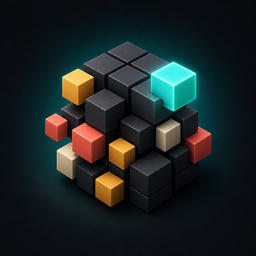
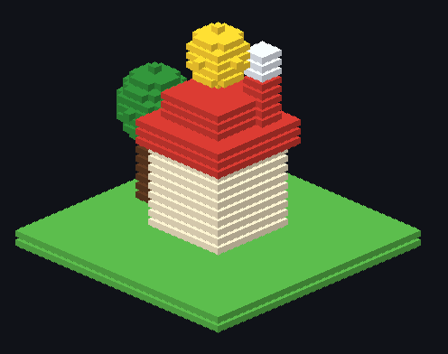
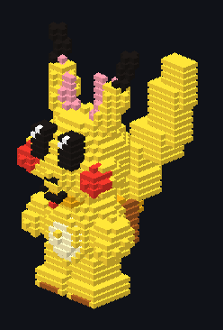

<p align="center">
  
</p>

# Voxel Editor

Cross-platform voxel editor inspired by [MagicaVoxel 0.99.7](https://github.com/ephtracy/ephtracy.github.io/releases/tag/0.99.7), with an **MCP server** so agents can place voxels, paint colors, fill shapes, and save `.vox` files.

<p align="center">
  
  &nbsp;
  
</p>

<p align="center">
  <em>MCP-generated examples — <code>examples/house.vox</code> and <code>examples/pikachu.vox</code></em>
</p>

> MagicaVoxel is **not open source** (binary-only). This project reimplements editor ops and `.vox` I/O from the public format docs in [ephtracy/voxel-model](https://github.com/ephtracy/voxel-model).

## Crates

| Crate | Role |
|-------|------|
| `voxel-core` | Grid, palette, brushes (box/sphere/flood/mirror) |
| `voxel-vox` | MagicaVoxel `.vox` read/write (SIZE/XYZI/RGBA; scene graph nTRN/nGRP/nSHP; MATL; LAYR) |
| `voxel-mcp` | MCP tool surface |
| `voxel-mcp-server` | stdio MCP binary |
| `voxel-export` | Godot 4 `.glb` + `.tscn` |
| `voxel-editor` | egui 3D viewport + Model/World UI (macOS / Windows / Linux) |

## Build

```bash
cargo build --release
```

Binaries:

- `target/release/voxel-editor`
- `target/release/voxel-mcp-server`

macOS `.app` (always rebuilds both binaries, includes the MCP server):

```bash
./scripts/pack-macos.sh
open dist/Voxel\ Editor.app
```

## Run the editor

```bash
cargo run -p voxel_editor --release
# or
./target/release/voxel-editor
# or
open dist/Voxel\ Editor.app
```

Default document (GUI and MCP share this file):

`~/Documents/n2d98 Voxel Editor/project.vox`

Override with `VOXEL_PROJECT=/path/to/file.vox` or by passing a `.vox` path as the first argument. Hover the filename in the top bar to see the full path.

```bash
VOXEL_PROJECT=./examples/pikachu.vox cargo run -p voxel_editor --release
```

### 3D viewport controls

| Input | Action |
|-------|--------|
| LMB | Paint (raycast onto voxels / volume) |
| Shift+LMB | Erase hit voxel |
| **Place** / **Overpaint** | Place paints the empty neighbor; Overpaint recolors the solid under the cursor |
| DRAW tools | Voxel = single cell. Line / Plane / Circle / Cube / Sphere: click two cells (or click-drag) to commit. Esc or Voxel cancels a pending anchor |
| ⌘Z / Ctrl+Z | Undo |
| ⌘⇧Z / Ctrl+Shift+Z / Ctrl+Y | Redo |
| Delete / Backspace | World mode: delete selected object (not voxels; not the scene root) |
| RMB / Alt+LMB | Orbit |
| MMB / Cmd+LMB | Pan |
| Scroll | Zoom |
| Slice checkbox | Optional 2D slice editor |
| Frame | Reset camera to the volume |

First launch seeds a small demo (two objects) so Model + World modes aren’t empty.

### Model vs World

| Mode | Behavior |
|------|----------|
| **Model** | Edit the active voxel volume (like MagicaVoxel model editor) |
| **World** | Scene graph of objects; click to select; translate / add / duplicate / delete |

World objects are stored as MagicaVoxel `nTRN` / `nGRP` / `nSHP` in `.vox`.

MCP world tools: `list_objects`, `add_object`, `duplicate_object`, `delete_object`, `set_object_translation`, `select_object`, `set_active_model`, `set_edit_mode`, `list_layers`, `set_layer`, `set_object_layer`, `undo`, `redo`.

Materials are per palette index (`get_material` / `set_material`). Hidden layers hide every object assigned to them.

## MCP (Cursor / Claude / etc.)

GUI and MCP must point at the **same** `.vox`. Default is `~/Documents/n2d98 Voxel Editor/project.vox`. After generate, the editor **Auto**-reloads that file (unsaved GUI edits are not overwritten).

After `./scripts/pack-macos.sh`, merge `dist/mcp.json` into Cursor MCP settings (or `~/.cursor/mcp.json`). The packed app includes `Contents/MacOS/voxel-mcp-server`.

```json
{
  "mcpServers": {
    "voxel-editor": {
      "command": "/ABS/PATH/TO/n2d98-voxel-editor/target/release/voxel-mcp-server",
      "args": ["--project", "/ABS/PATH/TO/HOME/Documents/n2d98 Voxel Editor/project.vox", "--size", "32"],
      "env": {
        "RUST_LOG": "info"
      }
    }
  }
}
```

Or from source without a prior release build:

```json
{
  "mcpServers": {
    "voxel-editor": {
      "command": "cargo",
      "args": [
        "run",
        "-q",
        "-p",
        "voxel_mcp_server",
        "--",
        "--project",
        "/ABS/PATH/TO/HOME/Documents/n2d98 Voxel Editor/project.vox"
      ]
    }
  }
}
```

Coordinates follow MagicaVoxel: **X right, Y depth, Z up**. Colors are palette indices **1..=255**.

### Tools

| Tool | Purpose |
|------|---------|
| `get_scene_info` | Size, voxel count, brush |
| `list_voxels` | Occupied voxels (truncated if huge) |
| `set_voxel` / `erase_voxel` | Single cell |
| `fill_box` / `fill_sphere` / `fill_line` / `fill_circle` / `fill_plane` / `flood_fill` | Shapes |
| `undo` / `redo` | Session history (mutating tools checkpoint) |
| `delete_object` | Remove a world transform (not scene root) |
| `set_brush` / `apply_brush` | MagicaVoxel-like brush + mirror |
| `set_active_color` / `set_palette_color` / `get_palette_color` | Palette |
| `get_material` / `set_material` | MagicaVoxel `MATL` (per palette index) |
| `list_layers` / `set_layer` / `set_object_layer` | MagicaVoxel `LAYR` |
| `clear_model` / `resize_model` / `mirror_model` | Volume ops |
| `save_vox` / `load_vox` / `reload` | Persistence |
| `export_godot` | Godot 4 `.glb` + `.tscn` (`scope`: world \| model) |

## Godot export

`export_godot` (or the **Godot** button) writes:

- `{name}.glb` — glTF 2.0 binary, Y-up, vertex colors, unlit. 1 voxel = 1 Godot unit. World objects become separate nodes.
- `{name}.tscn` — wrapper that instances the `.glb` at `res://{name}.glb`

Drop the `.glb` into a Godot 4 project (or instance it). `scope`: `world` (default, all objects) or `model` (active model only).

## Feature roadmap (parity with MV 0.99.7)

- [x] Dense model + 256 palette
- [x] `.vox` import/export (basic)
- [x] MCP place/paint/fill
- [x] Slice GUI
- [x] 3D GPU viewport (orbit + raycast paint)
- [x] World editor scene graph (`nTRN`/`nGRP`/`nSHP`)
- [x] Auto-reload when MCP writes the open `.vox`
- [x] Godot 4 export
- [x] Materials (`MATL`), layers (`LAYR`)
- [x] Undo / redo, overpaint, shape tools, delete object
- [ ] Frame animation
- [ ] Path-trace preview
- [ ] Pattern / face / sculpt brushes
- [ ] Object rotation gizmos

## License

MIT. MagicaVoxel name/assets belong to ephtracy; this is an independent reimplementation.
